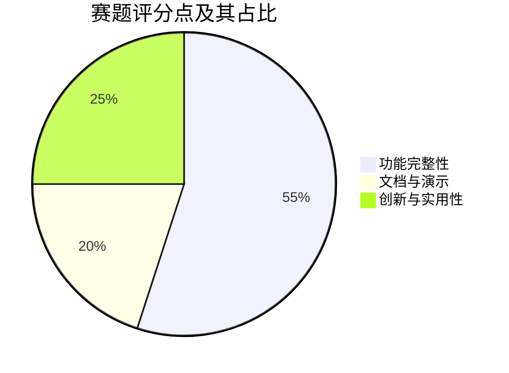

# 02 功能清单

> 功能需求与赛题评分对照

---

## 赛题评分权重

| 评分维度 | 权重 | 说明 |
|----------|------|------|
| 功能完整性 | 55% | 核心功能实现程度 |
| 创新与实用性 | 25% | 差异化能力 + 实际价值 |
| 文档与演示 | 20% | 文档质量 + 演示效果 |

---

## 功能需求清单

### 基本功能需求

| 功能点 | 说明 | 对应赛题需求 |
|--------|------|-------------|
| **OS 环境深度感知** | Agent 自动调用底层工具（lsof、netstat、journalctl）获取进程、网络、日志等实时上下文 | 需求 1 |
| **MCP 工具插件化** | 建立可扩展的运维工具注册中心，支持动态注册与调用 | 需求 2 |
| **安全运维校验器** | 建立风险识别模型或规则库，对 LLM 生成的原始指令进行二次过滤，识别高危参数（rm \| chmod ...） | 需求 3 |
| **Agent 最小权限执行** | 实现 Agent 的权限隔离，核心运维动作需在受限 Account 下运行，非必要不使用 root | 需求 4 |
| **推理链路溯源** | 完整记录"接收指令 → 感知环境 → 推理决策 → 安全校验 → 执行结果"的闭环日志，支持异常回溯 | 需求 5 |

### 非功能性需求

| 需求 | 说明 |
|------|------|
| **确定性与可靠性** | 严禁 Agent 在未授权情况下修改系统关键配置文件 |
| **抗注入能力** | Agent 需能识别提示词注入，防止攻击者通过对话诱导 Agent 执行恶意代码 |

### 架构约束

| 约束 | 说明 |
|------|------|
| **龙芯架构** | 目标部署平台为龙芯 loongarch64 |
| **B/S 架构** | 浏览器/服务器架构，支持 Web 端交互 |
| **麒麟高级服务器版 V11** | 操作系统为银河麒麟高级服务器版 V11 |

---

## 功能与赛题需求映射

| 赛题需求 | 功能点 | 当前状态 |
|----------|--------|---------|
| OS 环境深度感知 | 探针模块（disk/process/network/logs） | 已实现 |
| MCP 工具插件化 | ToolRegistry + MCPTool 基类 | 已实现（10 个内置工具） |
| 安全运维校验器 | 正则 + 语义双层校验 | 已实现 |
| 最小权限执行 | devops-runner 账户 + sudo 规则 | 已实现 |
| 推理链路溯源 | 五段式审计日志落库 | 已实现 |
| 抗提示词注入 | 三层防御 + 结构化 Prompt 隔离 | 已实现 |
| SELinux 策略 | Policy module 设计 | 文档已完成，待部署 |

---

*功能清单基于 [baseNeed.mmd](../assets/baseNeed.mmd) 整理 | 评分权重来自 [scorePie.mmd](../assets/scorePie.mmd)*
