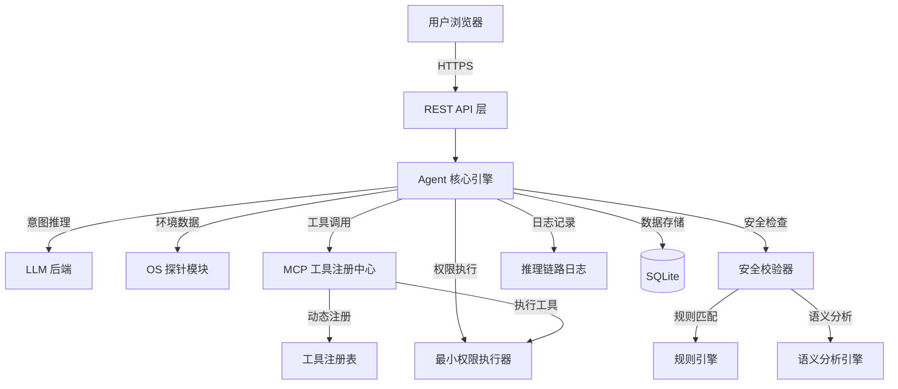

# 软件需求分析文档（SRS）

> 面向麒麟操作系统的安全智能运维 Agent 设计与实现
> 赛题编号：A2 · 第十五届中国软件杯大学生软件设计大赛

| 项目 | 内容 |
|------|------|
| 文档版本 | v1.0 |
| 编制日期 | 2026-04-29 |
| 赛题来源 | 麒麟软件有限公司 |
| 目标平台 | LoongArch64 + 麒麟高级服务器版 V11 |
| 文档性质 | 初赛交付物 #1：软件功能需求分析文档 |

---

## 目录

- [1 引言](#1-引言)
  - [1.1 编写目的](#11-编写目的)
  - [1.2 项目背景](#12-项目背景)
  - [1.3 术语与缩写](#13-术语与缩写)
  - [1.4 参考文档](#14-参考文档)
- [2 项目概述](#2-项目概述)
  - [2.1 产品定位](#21-产品定位)
  - [2.2 业务场景](#22-业务场景)
  - [2.3 用户特征](#23-用户特征)
  - [2.4 运行环境](#24-运行环境)
  - [2.5 设计约束](#25-设计约束)
- [3 功能需求](#3-功能需求)
  - [3.1 FR-01 自然语言交互](#31-fr-01-自然语言交互)
  - [3.2 FR-02 OS 环境深度感知](#32-fr-02-os-环境深度感知)
  - [3.3 FR-03 MCP 运维工具插件化](#33-fr-03-mcp-运维工具插件化)
  - [3.4 FR-04 安全意图校验](#34-fr-04-安全意图校验)
  - [3.5 FR-05 最小权限执行](#35-fr-05-最小权限执行)
  - [3.6 FR-06 推理链路溯源](#36-fr-06-推理链路溯源)
  - [3.7 FR-07 抗提示词注入](#37-fr-07-抗提示词注入)
  - [3.8 FR-08 B/S Web 管理界面](#38-fr-08-bs-web-管理界面)
  - [3.9 FR-09 配置管理](#39-fr-09-配置管理)
  - [3.10 FR-10 审计日志管理](#310-fr-10-审计日志管理)
- [4 非功能性需求](#4-非功能性需求)
  - [4.1 确定性与可靠性](#41-确定性与可靠性)
  - [4.2 安全性](#42-安全性)
  - [4.3 性能要求](#43-性能要求)
  - [4.4 可移植性](#44-可移植性)
  - [4.5 可维护性](#45-可维护性)
  - [4.6 兼容性](#46-兼容性)
- [5 系统架构概述](#5-系统架构概述)
  - [5.1 总体架构](#51-总体架构)
  - [5.2 核心模块关系](#52-核心模块关系)
- [6 功能需求追踪矩阵](#6-功能需求追踪矩阵)
- [7 验收标准](#7-验收标准)
- [8 风险分析与应对](#8-风险分析与应对)
- [9 附录](#9-附录)

---

## 1 引言

### 1.1 编写目的

本文档是"面向麒麟操作系统的安全智能运维 Agent"项目的软件需求分析文档（Software Requirements Specification, SRS），旨在：

1. **明确赛题需求**：对中国软件杯 A2 赛题中的全部功能需求、非功能性需求及约束条件进行结构化分析与整理；
2. **指导开发实现**：为后续的功能设计、编码实现、测试验收提供统一的需求基线；
3. **作为交付物**：满足赛题初赛提交清单中"软件功能需求分析文档"的要求。

### 1.2 项目背景

在企业级数据中心（如教育、医疗行业），运维人员常需处理复杂的操作系统问题——僵尸进程堆积、磁盘 I/O 异常、配置文件漂移等。传统运维依赖复杂脚本和监控告警，门槛极高，尤其对于非专职 Linux 管理员（如兼岗教师、信息科人员）而言更是难以胜任。

本项目旨在开发一套部署于操作系统的智能运维 Agent，作为自然语言与操作系统交互的桥梁。Agent 通过实现 MCP（Model Context Protocol）协议，赋予大语言模型感知系统实时状态、采集运维指标及执行管理任务的能力，同时通过"安全护栏"架构杜绝误操作风险。

### 1.3 术语与缩写

| 术语/缩写 | 全称 | 说明 |
|-----------|------|------|
| Agent | Intelligent Agent | 智能体，能够自主感知环境并执行任务的软件实体 |
| LLM | Large Language Model | 大语言模型，如 DeepSeek、Qwen 等 |
| MCP | Model Context Protocol | 模型上下文协议，定义 Agent 与工具插件间的通信规范 |
| B/S | Browser/Server | 浏览器/服务器架构 |
| SPA | Single Page Application | 单页应用 |
| SSE | Server-Sent Events | 服务器推送事件，用于流式数据传输 |
| SELinux | Security-Enhanced Linux | 安全增强型 Linux，提供强制访问控制 |
| LoongArch | Loongson Architecture | 龙芯自主指令集架构 |
| SRS | Software Requirements Specification | 软件需求分析文档 |
| CRUD | Create / Read / Update / Delete | 增删改查基本操作 |
| API | Application Programming Interface | 应用程序编程接口 |

### 1.4 参考文档

| 编号 | 文档名称 | 来源 |
|------|----------|------|
| [1] | 赛题A2：面向麒麟操作系统的安全智能运维Agent设计与实现 | 中国软件杯官网 cnsoftbei.com |
| [2] | MCP 协议规范 | Model Context Protocol 官方文档 |
| [3] | 麒麟高级服务器版V11 技术白皮书 | 麒麟软件有限公司 |
| [4] | GB/T 8567-2006 计算机软件文档编制规范 | 国家标准 |

---

## 2 项目概述

### 2.1 产品定位

**一句话定义**：面向国产化环境（龙芯 LoongArch64 + 麒麟高级服务器版 V11）的运维智能体平台，B/S 架构，支持管理员通过自然语言驱动 Agent 自动感知 OS 环境、执行运维操作，具备全链路安全校验与权限隔离能力。

**核心价值**：降低国产化服务器运维门槛——让非专职运维人员通过自然语言对话即可完成复杂运维操作，同时确保每一步操作均经过安全校验和权限管控。

### 2.2 业务场景

#### 2.2.1 典型使用场景

赛题提炼的核心业务场景为：

> 模拟一个真实的 Linux 生产节点，运维人员通过自然语言向 Agent 发出运维指令，Agent 主动感知系统环境、推理决策、安全校验后执行操作，并记录完整推理链路供审计回溯。

#### 2.2.2 典型交互流程示例

**场景**：管理员发现服务器响应缓慢，与 Agent 交互排查。

```
管理员（自然语言）  →  "系统好像很慢，帮我看看什么情况"
    │
    ▼
Agent（环境感知）  →  调用 ps/top/netstat/journalctl 等探针
    │                 获取 CPU、内存、磁盘、网络、进程实时状态
    ▼
Agent（推理分析）  →  结合探针数据，定位到僵尸进程堆积 + 磁盘 I/O 高
    │
    ▼
Agent（安全校验）  →  对即将执行的清理操作进行意图风险评估
    │                 检查操作目标是否为关键系统组件
    ▼
Agent（最小权限）  →  以受限账户执行清理操作
    │                 仅授予操作所需的最小权限
    ▼
Agent（结果反馈）  →  返回操作结果 + 推理过程 + 风险评估报告
    │                 完整链路记录至审计日志
    ▼
管理员              →  查看结果，确认系统恢复正常
```

#### 2.2.3 领域适应性

本系统需适配以下典型行业场景：

| 行业 | 特点 | 运维痛点 |
|------|------|----------|
| 教育行业 | 学校信息中心兼岗运维 | 专职运维人员少，老师兼岗维护 |
| 医疗行业 | HIS/PACS 系统高可用要求 | 7×24 运行，故障影响大 |
| 政务行业 | 国产化替代推进中 | 龙芯 + 麒麟环境，生态工具匮乏 |

### 2.3 用户特征

| 用户角色 | 描述 | 典型技能水平 |
|----------|------|-------------|
| **运维管理员**（主要用户） | 负责国产化服务器日常运维，使用 Agent 完成环境监控、故障排查、配置管理等 | 具备基础 Linux 知识，但不熟悉复杂命令和脚本 |
| **系统审计员**（次要用户） | 通过审计日志审查 Agent 的操作记录，追溯历史操作 | 具备安全审计经验 |
| **系统管理员**（次要用户） | 管理 Agent 自身的配置、模型选择、权限策略等 | 具备 Linux 系统管理经验 |

### 2.4 运行环境

#### 2.4.1 硬件环境

| 项目 | 要求 |
|------|------|
| 处理器架构 | **LoongArch64**（龙芯自主指令集） |
| 内存 | ≥ 8 GB |
| 存储 | ≥ 50 GB 可用磁盘空间 |
| 网络 | 内网部署，需 HTTPS 访问 |

#### 2.4.2 软件环境

| 项目 | 版本/规格 |
|------|-----------|
| 操作系统 | 麒麟高级服务器版 V11 (Kylin V11) |
| Python | 3.12+ |
| 数据库 | SQLite 3.x（Agent 自带） |
| Web 服务器 | Uvicorn ASGI Server |
| 浏览器（客户端） | Chrome 80+ / Firefox 80+ / Edge 80+ |
| 大语言模型 | 国产开源模型优先（DeepSeek / Qwen3），支持 API 远程调用 |

#### 2.4.3 开发环境

| 项目 | 说明 |
|------|------|
| 开发平台 | VMware 虚拟机（麒麟 V11 x86_64）→ 后期迁移龙芯真机 |
| 开发语言 | Python 3.12（后端）、JavaScript/TypeScript（前端） |
| 前端框架 | React 18 + Vite + Tailwind CSS |
| 后端框架 | FastAPI + Uvicorn |
| 代码管理 | Git |

### 2.5 设计约束

| 约束编号 | 约束类型 | 约束描述 |
|----------|----------|----------|
| DC-01 | 架构约束 | 必须采用 **B/S 架构**，浏览器端与服务器端分离 |
| DC-02 | 平台约束 | 必须在 **LoongArch64 + 麒麟高级服务器版 V11** 上运行 |
| DC-03 | 安全约束 | 严禁 Agent 在未授权情况下修改系统关键配置文件 |
| DC-04 | 权限约束 | 核心 OS 操作必须在最小权限账户下执行，非必要不使用 root |
| DC-05 | 审计约束 | 每次操作必须记录完整推理链路，支持异常回溯 |
| DC-06 | 模型约束 | 鼓励使用国产开源模型（DeepSeek、Qwen3 等） |
| DC-07 | 通信约束 | B/S 通信走 HTTPS，内网部署 |
| DC-08 | SELinux 约束 | SELinux 必须处于 enforcing 模式，不得降级为 permissive |

---

## 3 功能需求

### 3.1 FR-01 自然语言交互

> **赛题映射**：Agent 作为自然语言与 OS 交互的桥梁

#### 3.1.1 功能描述

用户通过浏览器端以自然语言（中文）向 Agent 发出运维指令，Agent 理解用户意图后调用相应工具完成操作，并以自然语言返回结果。

#### 3.1.2 子需求

| 编号 | 子需求 | 优先级 | 描述 |
|------|--------|--------|------|
| FR-01-01 | 多轮对话 | P0 | 支持会话上下文保持，用户可在同一会话中连续追问 |
| FR-01-02 | 意图识别 | P0 | Agent 能准确理解运维意图（查询/执行/诊断/修改等） |
| FR-01-03 | 流式响应 | P1 | 支持 SSE 流式输出推理过程和操作结果，提升交互体验 |
| FR-01-04 | 会话管理 | P1 | 支持创建、查看、删除、切换多个对话会话 |
| FR-01-05 | 上下文记忆 | P1 | Agent 能跨轮次记忆对话内容，引用前文信息进行推理 |
| FR-01-06 | 消息持久化 | P1 | 所有对话消息持久化存储，支持历史对话回溯 |

#### 3.1.3 输入/输出

| 项目 | 说明 |
|------|------|
| 输入 | 用户通过 Web 界面输入的自然语言文本 |
| 输出 | Agent 生成的自然语言回复，可能包含系统状态信息、操作结果、建议等 |

---

### 3.2 FR-02 OS 环境深度感知

> **赛题映射**：Agent 能够自动调用底层工具（如 lsof, netstat, journalctl）获取进程、网络、日志等实时上下文

#### 3.2.1 功能描述

Agent 具备主动感知操作系统实时状态的能力，能够通过底层系统工具采集进程、网络、磁盘、日志等多维度运维数据，为推理决策提供环境上下文。

#### 3.2.2 子需求

| 编号 | 子需求 | 优先级 | 描述 |
|------|--------|--------|------|
| FR-02-01 | 进程探针 | P0 | 获取系统进程列表、CPU/内存占用、僵尸进程检测 |
| FR-02-02 | 磁盘探针 | P0 | 获取磁盘分区使用率、inode 使用率、I/O 统计 |
| FR-02-03 | 网络探针 | P0 | 获取网络连接状态（netstat/ss）、端口监听、网络流量 |
| FR-02-04 | 日志探针 | P0 | 获取系统日志（journalctl）、服务日志、内核日志 |
| FR-02-05 | 系统概览 | P1 | 获取系统基础信息（主机名、内核版本、运行时间、负载） |
| FR-02-06 | 探针 API 化 | P1 | 所有探针数据通过 REST API 对外暴露，支持 Web 前端直接查询 |

#### 3.2.3 探针实现方式

| 探针类型 | 底层工具/库 | 采集指标 |
|----------|-------------|----------|
| 进程探针 | `psutil` + `subprocess(ps/top)` | PID、进程名、CPU%、MEM%、状态、运行时间 |
| 磁盘探针 | `psutil` + `subprocess(df/du)` | 分区、总量、已用、可用、使用率、挂载点 |
| 网络探针 | `subprocess(ss/netstat)` | 连接数、监听端口、协议、状态（ESTABLISHED/LISTEN等） |
| 日志探针 | `subprocess(journalctl)` | 时间戳、服务单元、日志级别、日志内容 |
| 系统概览 | `platform` + `os` + `psutil` | 主机名、内核版本、发行版、运行时间、CPU/内存概况 |

---

### 3.3 FR-03 MCP 运维工具插件化

> **赛题映射**：建立可扩展的运维工具注册中心，支持动态注册与调用

#### 3.3.1 功能描述

采用 MCP（Model Context Protocol）插件化架构，将常用运维动作封装为 Agent 可调用的工具（Tool）。Agent 根据用户意图自主选择和调用工具，并支持动态扩展新工具。

#### 3.3.2 子需求

| 编号 | 子需求 | 优先级 | 描述 |
|------|--------|--------|------|
| FR-03-01 | 工具注册中心 | P0 | 提供统一的工具注册/发现/调用机制（ToolRegistry 单例） |
| FR-03-02 | MCPTool 基类 | P0 | 定义工具基类接口（名称、描述、参数 schema、执行方法） |
| FR-03-03 | 内置工具集 | P0 | 预置常用运维工具（至少 10 个），涵盖文件操作、系统管理、网络诊断等 |
| FR-03-04 | 动态扩展 | P1 | 支持在运行时注册新工具，无需重启服务 |
| FR-03-05 | 工具发现 API | P1 | 提供 REST API 列出所有已注册工具及其参数描述 |
| FR-03-06 | 工具执行日志 | P1 | 每次工具调用记录参数、返回值、执行时长 |

#### 3.3.3 内置工具清单

| 工具名称 | 功能 | 类别 |
|----------|------|------|
| `execute_command` | 执行 Shell 命令（受限白名单） | 系统管理 |
| `read_file` | 读取文件内容 | 文件操作 |
| `write_file` | 写入文件（受限目录） | 文件操作 |
| `list_directory` | 列出目录内容 | 文件操作 |
| `get_system_info` | 获取系统基础信息 | 系统管理 |
| `get_process_list` | 获取进程列表 | 系统管理 |
| `get_disk_usage` | 获取磁盘使用情况 | 系统管理 |
| `get_network_connections` | 获取网络连接 | 网络诊断 |
| `get_service_status` | 获取服务状态 | 系统管理 |
| `get_journal_logs` | 获取系统日志 | 日志管理 |
| `ping_host` | 网络连通性检测 | 网络诊断 |
| `check_port` | 端口检测 | 网络诊断 |
| `file_stat` | 获取文件详细信息 | 文件操作 |

#### 3.3.4 工具调用流程

```
用户自然语言指令
    ↓
LLM 推理 → 决定需要调用哪些工具
    ↓
ToolRegistry 查找工具 → 获取工具定义
    ↓
安全校验器（FR-04） → 检查工具调用的安全性
    ↓
工具执行（受限账户/最小权限）
    ↓
结果返回 LLM → 生成自然语言回复
    ↓
审计日志记录（FR-06）
```

---

### 3.4 FR-04 安全意图校验

> **赛题映射**：建立风险识别模型或规则库，对 LLM 生成的原始指令进行"二次过滤"，识别高危参数

#### 3.4.1 功能描述

在 LLM 生成操作指令后、实际执行前，对指令进行安全意图校验。采用规则匹配与语义分析相结合的双层校验机制，识别并拦截高危操作。

#### 3.4.2 子需求

| 编号 | 子需求 | 优先级 | 描述 |
|------|--------|--------|------|
| FR-04-01 | 规则匹配层 | P0 | 基于正则表达式和模式匹配识别高危操作（rm -rf、chmod 777、dd 等） |
| FR-04-02 | 语义分析层 | P1 | 基于关键词权重和上下文语义判断操作风险等级（高/中/低） |
| FR-04-03 | 风险分级 | P0 | 将操作风险划分为 BLOCK（直接拦截）、WARN（警告确认）、ALLOW（放行）三级 |
| FR-04-04 | 校验日志 | P0 | 每次安全校验记录输入、结果、理由 |
| FR-04-05 | 校验 API | P1 | 提供安全状态查询 API，可查看当前安全策略和校验统计 |

#### 3.4.3 高危操作规则示例

| 风险等级 | 操作类型 | 示例 | 处理策略 |
|----------|----------|------|----------|
| BLOCK | 强制删除根目录 | `rm -rf /` | 直接拦截，拒绝执行 |
| BLOCK | 修改关键系统目录 | `rm -rf /etc /usr /bin` | 直接拦截，拒绝执行 |
| BLOCK | 危险权限变更 | `chmod 777 /etc` | 直接拦截，拒绝执行 |
| BLOCK | 磁盘覆写 | `dd if=/dev/zero of=/dev/sda` | 直接拦截，拒绝执行 |
| BLOCK | 关闭防火墙 | `systemctl stop firewalld` | 直接拦截，拒绝执行 |
| WARN | 删除文件 | `rm -rf /var/log/app.log` | 警告确认，要求用户二次确认 |
| WARN | 停止服务 | `systemctl stop nginx` | 警告确认，提示影响范围 |
| WARN | 修改配置 | 编辑 `/etc/` 下文件 | 警告确认，提示风险 |
| ALLOW | 查询操作 | `ls`、`cat`、`df -h` | 直接放行 |
| ALLOW | 日志查看 | `journalctl -u xxx` | 直接放行 |

---

### 3.5 FR-05 最小权限执行

> **赛题映射**：实现 Agent 的权限隔离，核心运维动作需在受限 Account 下运行，非必要不使用 root

#### 3.5.1 功能描述

Agent 执行的运维操作须遵循最小权限原则（Principle of Least Privilege），通过操作系统级的权限隔离机制，确保 Agent 仅能执行授权范围内的操作。

#### 3.5.2 子需求

| 编号 | 子需求 | 优先级 | 描述 |
|------|--------|--------|------|
| FR-05-01 | 专用运行账户 | P0 | 创建专用的受限账户（devops-runner）运行 Agent 工具 |
| FR-05-02 | sudo 精细规则 | P0 | 通过 sudoers 配置仅授权特定命令的最小权限子集 |
| FR-05-03 | 权限映射 | P1 | 将工具调用请求映射到对应的 sudo 规则或受限账户操作 |
| FR-05-04 | 执行审计 | P1 | 记录每次执行的运行账户、权限级别、命令内容 |

#### 3.5.3 权限设计

```
┌─────────────────────────────────────────────┐
│              Web 管理界面（浏览器）            │
│         用户以管理员身份登录/操作              │
└──────────────────┬──────────────────────────┘
                   │ HTTPS
┌──────────────────▼──────────────────────────┐
│           FastAPI 后端（root 启动）           │
│         仅负责 API 路由和调度                 │
└──────────────────┬──────────────────────────┘
                   │ 工具执行请求
┌──────────────────▼──────────────────────────┐
│      工具执行器（devops-runner 账户）          │
│    通过 sudo 仅执行白名单内的受限命令           │
│    /etc/sudoers.d/devops-agent 精细规则       │
└─────────────────────────────────────────────┘
```

---

### 3.6 FR-06 推理链路溯源

> **赛题映射**：完整记录"接收指令 → 感知环境 → 推理决策 → 安全校验 → 执行结果"的闭环日志

#### 3.6.1 功能描述

对 Agent 处理每条用户指令的全过程进行五阶段记录，形成完整的推理链路日志，支持事后审计和异常回溯。

#### 3.6.2 五段式推理链路

| 阶段 | 名称 | 描述 | 记录内容 |
|------|------|------|----------|
| Stage 1 | SENSE（感知） | Agent 采集系统环境数据 | 调用了哪些探针、获取了什么数据 |
| Stage 2 | ANALYZE（分析） | Agent 分析环境数据 | 数据分析结论、异常检测结果 |
| Stage 3 | PLAN（规划） | Agent 制定操作方案 | 计划执行的操作、选择的工具及理由 |
| Stage 4 | EXECUTE（执行） | Agent 执行操作 | 执行的命令、工具调用及返回值 |
| Stage 5 | OUTPUT（输出） | Agent 生成最终回复 | 返回给用户的内容、操作总结 |

#### 3.6.3 子需求

| 编号 | 子需求 | 优先级 | 描述 |
|------|--------|--------|------|
| FR-06-01 | 五段式日志记录 | P0 | 每次推理完整记录 SENSE→ANALYZE→PLAN→EXECUTE→OUTPUT 五个阶段 |
| FR-06-02 | 日志持久化 | P0 | 推理链路日志落库（SQLite），关联会话 ID |
| FR-06-03 | 日志查询 API | P1 | 提供按会话 ID 查询推理链路的 REST API |
| FR-06-04 | 前端展示 | P1 | Web 界面展示推理链路折叠面板，支持逐阶段查看 |
| FR-06-05 | 注入拦截记录 | P1 | 安全校验器拦截操作时，额外记录拦截原因和风险评估 |

---

### 3.7 FR-07 抗提示词注入

> **赛题映射**：Agent 需能识别提示词注入（Prompt Inject），防止攻击者通过对话诱导 Agent 执行恶意代码

#### 3.7.1 功能描述

系统需具备多层次的提示词注入防御能力，防止恶意用户通过精心构造的自然语言指令诱导 Agent 执行未授权操作或泄露系统信息。

#### 3.7.2 三层防御体系

| 层次 | 名称 | 机制 | 描述 |
|------|------|------|------|
| 第一层 | 输入检测 | 正则 + 关键词匹配 | 检测已知注入模式（如 "ignore previous instructions"、"system:"等） |
| 第二层 | 结构化 Prompt 隔离 | System/User/Assistant 角色严格分离 | 用户输入仅注入 User 角色，无法篡改 System Prompt |
| 第三层 | 输出审计 | 语义分析 + 安全校验 | 对 LLM 输出的指令进行二次安全校验（复用 FR-04） |

#### 3.7.3 子需求

| 编号 | 子需求 | 优先级 | 描述 |
|------|--------|--------|------|
| FR-07-01 | 注入模式检测 | P0 | 维护已知注入攻击模式库，对用户输入进行实时检测 |
| FR-07-02 | Prompt 角色隔离 | P0 | 严格区分 System/User/Assistant 消息角色，防止角色越权 |
| FR-07-03 | 输出安全审计 | P0 | 对 LLM 生成的工具调用指令执行安全校验（复用 FR-04 机制） |
| FR-07-04 | 注入事件记录 | P1 | 记录所有注入检测事件，包括输入内容、检测结果、处理方式 |

---

### 3.8 FR-08 B/S Web 管理界面

> **赛题映射**：采用 B/S 架构开发

#### 3.8.1 功能描述

提供基于浏览器的 Web 管理界面，作为用户与 Agent 交互的主要入口。采用 SPA（单页应用）架构，提供现代化的运维管理体验。

#### 3.8.2 子需求

| 编号 | 子需求 | 优先级 | 描述 |
|------|--------|--------|------|
| FR-08-01 | 对话界面 | P0 | 类终端聊天界面，支持自然语言输入、流式响应显示、消息历史 |
| FR-08-02 | 系统监控仪表板 | P1 | 可视化展示系统 CPU、内存、磁盘、网络等实时状态 |
| FR-08-03 | 推理链路面板 | P1 | 展示当前对话的推理过程（五段式链路折叠面板） |
| FR-08-04 | 工具管理页面 | P1 | 查看已注册工具列表、工具描述、参数 schema |
| FR-08-05 | 安全状态页面 | P1 | 查看安全校验统计、拦截记录、风险事件 |
| FR-08-06 | 配置管理页面 | P1 | 管理 LLM 模型配置、API 密钥、系统参数 |
| FR-08-07 | 会话管理 | P1 | 创建/切换/删除对话会话，查看历史会话列表 |
| FR-08-08 | 终端侧板 | P2 | 集成 Web Terminal（xterm.js），支持快捷命令执行 |
| FR-08-09 | 响应式布局 | P2 | 适配不同分辨率显示器 |

---

### 3.9 FR-09 配置管理

#### 3.9.1 功能描述

支持对 Agent 系统的运行时配置进行动态管理，包括 LLM 模型选择、API 参数调整等，无需重启服务即可生效。

#### 3.9.2 子需求

| 编号 | 子需求 | 优先级 | 描述 |
|------|--------|--------|------|
| FR-09-01 | 分层配置机制 | P1 | `.env` 文件提供默认值，数据库运行时覆盖，DB 优先级高于 .env |
| FR-09-02 | 配置 CRUD API | P1 | 提供 `/api/v1/config` GET/PUT/POST/DELETE 端点 |
| FR-09-03 | Web 配置界面 | P1 | Settings 页面可视化修改 LLM 模型、API Base URL、API Key 等 |
| FR-09-04 | 配置热更新 | P2 | 修改配置后立即生效，无需重启服务 |

---

### 3.10 FR-10 审计日志管理

#### 3.10.1 功能描述

对系统中所有关键操作（安全校验、工具执行、配置变更等）进行完整的审计日志记录，支持按条件查询和统计分析。

#### 3.10.2 子需求

| 编号 | 子需求 | 优先级 | 描述 |
|------|--------|--------|------|
| FR-10-01 | 全链路审计 | P0 | 每次对话从接收到返回的完整操作链路落库 |
| FR-10-02 | 安全事件审计 | P0 | 记录安全校验结果（通过/拦截/警告）及详细理由 |
| FR-10-03 | 审计查询 API | P1 | 支持按时间范围、会话 ID、风险等级等条件查询审计日志 |
| FR-10-04 | 健康检查 | P1 | 系统健康检查端点，返回各组件运行状态 |

---

## 4 非功能性需求

### 4.1 确定性与可靠性

| 编号 | 需求 | 描述 | 验收标准 |
|------|------|------|----------|
| NFR-01 | 操作确定性 | Agent 的操作必须是可预测、可解释的 | 任何操作均有明确的决策依据记录 |
| NFR-02 | 关键配置保护 | 严禁修改未授权的系统关键配置 | `/etc/` 关键目录操作必须经过安全校验 + 用户确认 |
| NFR-03 | 异常处理 | Agent 执行失败时给出明确错误信息，不产生副作用 | 工具执行超时/失败时回退并记录日志 |
| NFR-04 | 服务可用性 | Agent 服务异常时不影响宿主系统 | Agent 进程崩溃不影响系统正常运行 |

### 4.2 安全性

| 编号 | 需求 | 描述 | 验收标准 |
|------|------|------|----------|
| NFR-05 | 通信加密 | B/S 通信走 HTTPS | 内网部署使用 TLS 加密传输 |
| NFR-06 | 抗注入 | 能识别常见提示词注入攻击 | 三层防御体系能拦截已知注入模式 |
| NFR-07 | 最小权限 | Agent 操作遵循最小权限原则 | 核心操作在受限账户下执行 |
| NFR-08 | SELinux 兼容 | SELinux 处于 enforcing 模式时正常运行 | 不降级 SELinux 模式 |
| NFR-09 | 配置写保护 | 关键系统配置文件受写保护 | ConfigGuard 机制拦截未授权写入 |

### 4.3 性能要求

| 编号 | 指标 | 目标值 | 说明 |
|------|------|--------|------|
| NFR-10 | 对话首字响应时间 | ≤ 5 秒 | 从用户发送到收到第一个字符 |
| NFR-11 | 探针数据采集时间 | ≤ 3 秒 | 单次完整系统探针采集 |
| NFR-12 | 安全校验延迟 | ≤ 100 ms | 单次安全校验处理时间 |
| NFR-13 | 并发会话支持 | ≥ 10 | 同时进行的活跃对话会话数 |
| NFR-14 | 页面加载时间 | ≤ 3 秒 | Web 界面首屏加载时间 |

### 4.4 可移植性

| 编号 | 需求 | 描述 |
|------|------|------|
| NFR-15 | 架构移植 | 系统需同时支持 x86_64（开发环境）和 LoongArch64（目标环境） |
| NFR-16 | 依赖兼容 | 所有 Python 依赖必须在 LoongArch64 + 麒麟 V11 上可安装 |
| NFR-17 | 容器化部署 | 支持通过安装包或容器方式一键部署 |

### 4.5 可维护性

| 编号 | 需求 | 描述 |
|------|------|------|
| NFR-18 | 代码规范 | 遵循 PEP 8 Python 编码规范 |
| NFR-19 | 模块化设计 | 各功能模块松耦合，支持独立升级 |
| NFR-20 | 配置外置 | 所有环境相关配置通过 .env / 数据库管理，不硬编码 |
| NFR-21 | 日志规范 | 统一日志格式，分级记录（DEBUG/INFO/WARNING/ERROR） |

### 4.6 兼容性

| 编号 | 需求 | 描述 |
|------|------|------|
| NFR-22 | 浏览器兼容 | 支持 Chrome 80+、Firefox 80+、Edge 80+ |
| NFR-23 | 模型兼容 | 支持多种 LLM 后端（Anthropic API / OpenAI 兼容 API） |
| NFR-24 | 数据库兼容 | 当前使用 SQLite，架构支持未来切换 PostgreSQL |

---

## 5 系统架构概述

### 5.1 总体架构

系统采用分层架构设计，从上到下分为四层：

```
┌─────────────────────────────────────────────────────────┐
│                    表示层（Presentation）                  │
│          React SPA · Web 管理界面 · SSE 流式交互           │
├─────────────────────────────────────────────────────────┤
│                    接口层（API Gateway）                   │
│         REST API · SSE Endpoint · 静态资源服务             │
├─────────────────────────────────────────────────────────┤
│                    业务逻辑层（Agent Core）                 │
│   ┌──────────┐ ┌──────────┐ ┌──────────┐ ┌──────────┐  │
│   │ LLM引擎  │ │ 推理链路  │ │ 安全校验  │ │ MCP工具  │  │
│   │ (Agent)  │ │ (Logger) │ │ (Safety) │ │(Registry)│  │
│   └──────────┘ └──────────┘ └──────────┘ └──────────┘  │
├─────────────────────────────────────────────────────────┤
│                    基础设施层（Infrastructure）              │
│   ┌──────────┐ ┌──────────┐ ┌──────────┐ ┌──────────┐  │
│   │ OS探针   │ │ SQLite   │ │ 权限执行  │ │ 配置管理  │  │
│   │(Probe)   │ │ (DB)     │ │(Executor)│ │ (Config) │  │
│   └──────────┘ └──────────┘ └──────────┘ └──────────┘  │
└─────────────────────────────────────────────────────────┘
```

### 5.2 核心模块关系



---

## 6 功能需求追踪矩阵

### 6.1 赛题需求 → 功能需求映射

| 赛题原始需求 | 对应功能需求 | 优先级 | 当前状态 |
|-------------|-------------|--------|---------|
| OS 环境深度感知（lsof/netstat/journalctl） | FR-02 | P0 | ✅ 已实现 |
| MCP 工具插件化 | FR-03 | P0 | ✅ 已实现 |
| 安全意图校验器（规则库 + 二次过滤） | FR-04 | P0 | ✅ 已实现 |
| 最小权限代理执行 | FR-05 | P0 | ✅ 已实现 |
| 推理链路溯源（闭环日志） | FR-06 | P0 | ✅ 已实现 |
| 确定性与可靠性（禁止未授权修改） | NFR-01/02/03 | P0 | ✅ 已实现 |
| 抗提示词注入 | FR-07 | P0 | ✅ 已实现 |
| B/S 架构 | FR-08 | P0 | ✅ 已实现 |
| LoongArch64 + 麒麟 V11 兼容 | NFR-15/16 | P0 | 🔄 开发环境就绪，待真机验证 |

### 6.2 评分权重 → 功能覆盖分析

| 评分维度 | 权重 | 覆盖的功能点 | 覆盖率 |
|----------|------|-------------|--------|
| 功能完整性 | 55% | FR-01~FR-10（全部核心功能） | 100% |
| 创新与实用性 | 25% | 三层抗注入、语义级安全校验、五段式推理链路 | — |
| 文档与演示 | 20% | 本文档 + 功能设计文档 + 测试报告 + 演示视频 | — |

---

## 7 验收标准

### 7.1 功能验收标准

| 验收项 | 验收条件 | 验证方法 |
|--------|----------|----------|
| 自然语言交互 | 用户能用中文描述运维问题，Agent 返回有意义的回复 | 端到端对话测试 |
| 环境感知 | Agent 能自动调用探针获取准确的系统状态数据 | 对比探针返回数据与系统实际数据 |
| 工具调用 | Agent 能根据意图自主选择并调用正确的工具 | 指定场景测试（如"查看磁盘"→调用 get_disk_usage） |
| 安全校验 | 高危操作被拦截，查询操作被放行 | 注入测试用例集验证 |
| 最小权限 | Agent 工具以受限账户执行，不直接使用 root | 检查进程运行用户和 sudo 日志 |
| 推理链路 | 每次对话完整记录五阶段日志 | 查询 API 验证日志完整性 |
| 抗注入 | 已知注入模式被识别并拦截 | Prompt 注入测试集验证 |
| Web 界面 | 所有页面正常加载，功能可用 | 浏览器功能测试 |

### 7.2 非功能验收标准

| 验收项 | 验收条件 | 验证方法 |
|--------|----------|----------|
| 首字响应 | ≤ 5 秒 | 计时测试 |
| 并发支持 | ≥ 10 个并发会话 | 压力测试 |
| SELinux | enforcing 模式下正常运行 | 检查 SELinux 状态并执行操作 |
| 平台兼容 | LoongArch64 真机上正常运行 | 真机部署测试 |

---

## 8 风险分析与应对

| 编号 | 风险描述 | 影响程度 | 发生概率 | 应对策略 |
|------|----------|----------|----------|----------|
| R-01 | LoongArch64 上部分 Python 库无预编译包，需源码编译 | 高 | 中 | 提前验证依赖兼容性，准备 Plan B 替代方案 |
| R-02 | SELinux enforcing 模式下 Agent 操作被拒绝 | 高 | 高 | 专门设计 SELinux policy module，提前测试 |
| R-03 | LLM 推理结果不确定性导致安全校验漏判 | 高 | 中 | 规则层 + 语义层双重校验，保守拦截策略 |
| R-04 | 提示词注入手法不断翻新，现有检测库可能遗漏 | 中 | 中 | 三层防御体系，结构化 Prompt 隔离为兜底 |
| R-05 | 国产化环境文档匮乏，问题排查困难 | 中 | 高 | 建立知识库，记录踩坑经验 |
| R-06 | 开发周期紧张，功能可能无法全部完成 | 高 | 中 | 按优先级排序，P0 必保、P1 尽保、P2 选做 |

---

## 9 附录

### 9.1 赛题交付物清单

本文档对应赛题初赛提交清单中的第 1 项"软件功能需求分析文档"。完整交付物清单如下：

| 序号 | 交付物 | 本文档覆盖情况 |
|------|--------|---------------|
| 1 | 软件功能需求分析文档 | **本文档** |
| 2 | 软件功能设计文档 | 项目 `docs-planning/` 目录 |
| 3 | 软件产品说明书 | 待编写 |
| 4 | 软件功能测试报告 | 待编写 |
| 5 | 软件性能测试报告 | 待编写 |
| 6 | 软件安装包及部署文档 | 已完成部署文档 |
| 7 | 软件源代码 | 已完成开发 |
| 8 | 软件功能演示 PPT | 待编写 |
| 9 | 功能演示视频（≤ 7 分钟） | 待录制 |

### 9.2 术语对照表

| 赛题原文术语 | 本文档术语 | 说明 |
|-------------|-----------|------|
| "深度感知" | OS 环境深度感知 | 通过探针采集系统多维度数据 |
| "MCP运维插件化" | MCP 运维工具插件化 | 基于 MCP 协议的工具注册/调用机制 |
| "安全意图校验器" | 安全意图校验 | 双层（规则+语义）安全校验机制 |
| "最小权限代理执行" | 最小权限执行 | 基于受限账户和 sudo 规则的权限隔离 |
| "推理链路溯源" | 推理链路溯源 | 五段式审计日志，支持异常回溯 |
| "安全护栏" | 安全护栏体系 | 安全校验 + 最小权限 + 抗注入的总体安全架构 |

### 9.3 文档变更记录

| 版本 | 日期 | 修改人 | 修改内容 |
|------|------|--------|----------|
| v1.0 | 2026-04-29 | — | 初始版本，完整覆盖赛题所有功能需求和非功能性需求 |

---

*本文档基于第十五届中国软件杯大赛 A2 赛题要求编写，作为初赛交付物"软件功能需求分析文档"提交。*
